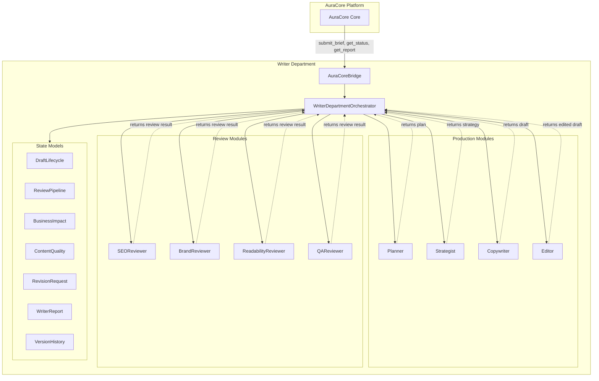
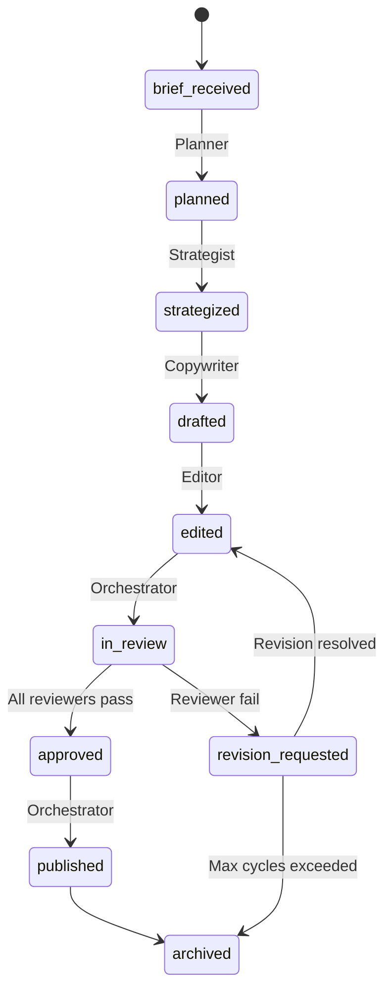

# AuraCore — System Map

> Last updated: 2026-07-07

## Overview

AuraCore is the agent orchestration layer. Departments are self-contained editorial/production units that communicate through orchestrators.



## Package layout

```
aura-core/
  docs/
    SYSTEM_MAP.md          ← this file
    PROJECT_STATUS.md
    DECISIONS.md
  packages/
    writer-department/
      src/
        config/            — pipeline order, thresholds, responsibilities
        types/             — shared types and interfaces
        models/            — lifecycle, pipeline, quality, impact models
        modules/           — production + review modules
        orchestrator/      — department orchestrator + AuraCore bridge
        mock/              — mock brief fixtures
      examples/            — runnable workflow demos
      tests/               — vitest test suites
```

## Draft lifecycle



## Review pipeline

Reviewers execute sequentially in this order:

1. **SEOReviewer** — seo
2. **BrandReviewer** — brand
3. **ReadabilityReviewer** — readability
4. **QAReviewer** — qa

On failure: revision request → target module (copywriter or editor) → re-review.

## Communication contracts

| From | To | Method |
|------|----|--------|
| AuraCore | Writer Department | `AuraCoreBridge.handleRequest()` |
| Orchestrator | Any module | `module.execute(input)` |
| Module | Orchestrator | `ModuleResponse<T>` |
| Reviewer | Reviewer | **FORBIDDEN** |
| Module | Module | **FORBIDDEN** |

## Related projects

| Project | Location | Relationship |
|---------|----------|-------------|
| Vector OS | `vector-os/` | Design system + UI Lab (separate concern) |
| MilePilot | `/workspace` root | Existing product (no AuraCore coupling yet) |
