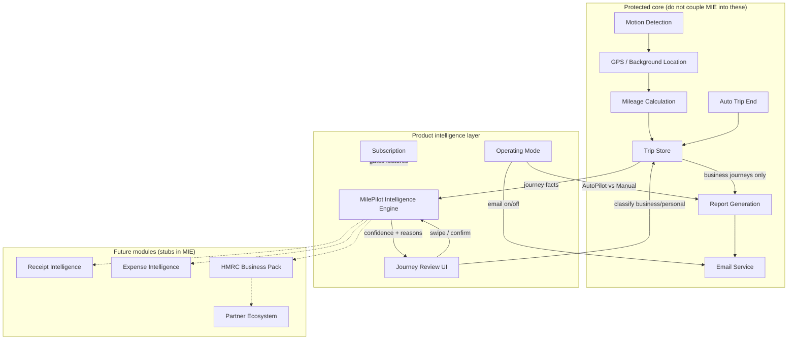

# MilePilot Intelligence Engine (MIE) — System Architecture

Sprint 2 establishes a **decoupled intelligence layer** that learns from journeys without controlling GPS, mileage calculation, reports, email, or subscription.

## Design principle

> The mileage engine records facts. MIE learns patterns. Reports consume classified business journeys.

No UI change should require rewriting protected core modules. See `docs/CRITICAL_FILES.md`.

---

## Module map

---

## Module responsibilities

| Module | File(s) | Responsibility |
|--------|---------|----------------|
| **GPS / tracking** | `frontend/index.html` (engine block), `tracking-provider.js`, `native-platform.js` | Record route points, distance, shift lifecycle |
| **Motion** | `frontend/index.html` | Device motion nudge when GPS stalls |
| **Auto trip end** | `frontend/js/trip-auto-end.js` | End shift after 90 min inactivity |
| **Trip store** | `frontend/js/trip-store.js` | Persist trips; default new trips as `pending` |
| **MIE** | `frontend/js/mie-intelligence-engine.js` | Confidence model, habit learning, daily review prep, AI explanations |
| **Journey review UI** | `frontend/js/journey-review.js` | End-of-day swipe stack, reason display |
| **Reports** | `frontend/js/summary-reports.js`, `report-archive.js` | PDF/email generation; only **confirmed business** journeys |
| **Email** | `backend/server.js`, `backend/reportEngine.js` | Delivery pipeline |
| **Operating mode** | `frontend/js/tracking-mode.js` | AutoPilot vs Manual workflows |
| **Subscription** | `frontend/js/subscription.js` | 7-day trial, £4.99/month gate |

---

## MIE data model (`mp_mie_model`)

Each journey teaches MIE:

- Start / end location clusters
- Route keys (start → end)
- Time-of-day and day-of-week slots
- Speed profile (slow / urban / mixed / fast)
- Business vs personal outcomes
- Whether the user **confirmed** or **corrected** the AI

Every analysis returns:

- `businessConfidence` / `personalConfidence`
- `likelyLabel`: Likely Business · Likely Personal · Needs Review
- `explanation`: title, reason, confidence %

### Auto-sort rules (strict)

- **Never** auto-claim Business without high confidence (≥ 88%) and clear route history
- Personal auto-sort at ≥ 82% when clearly dominant
- Low confidence → **Needs Review** (swipe UI)

---

## Workflows

### AutoPilot

1. Movement detected → background tracking
2. Shift ends (manual or auto-end)
3. MIE `prepareDailyReview()` auto-sorts confident journeys
4. User swipes uncertain journeys (< 30 seconds target)
5. Report emailed + saved to archive (after review save)

### Manual

1. User starts / ends shift
2. Same MIE review flow
3. **No** automatic email — user generates/sends from Report Centre

Report frequency (daily/weekly/monthly) is **removed from onboarding**. Mode controls delivery.

---

## Integration boundaries

| Direction | Allowed | Forbidden |
|-----------|---------|-----------|
| MIE → trips | Read trip geo/status; suggest classification | Start/stop GPS, mutate mileage |
| MIE → reports | None direct | Trigger email from MIE |
| UI → MIE | `analyseTrip`, `prepareDailyReview`, `onUserClassification` | Embed GPS logic in MIE |
| Reports → trips | Read `status === 'business'` | Re-classify trips |

---

## Future architecture hooks

`MPMIE` exposes stubs for:

- `analyseReceipt()` — AI receipt scanner
- `analyseExpense()` — recurring expense intelligence
- `buildTaxSummary()` — HMRC-ready business pack

Partner integrations (accountants, banking, fuel cards) should attach via **event bus / adapter interfaces**, not by editing the mileage engine.
