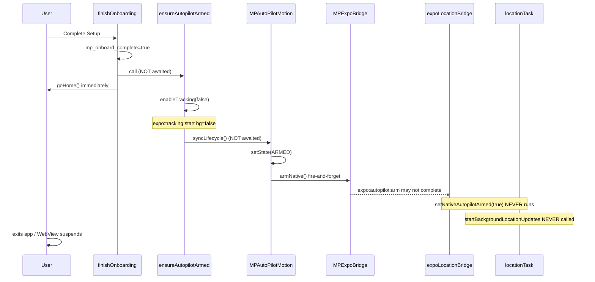

# MP-HF-011 — AutoPilot Arming Failure Root Cause

**Status:** Investigation complete — no code changes applied  
**Branch analysed:** `cursor/mp-hf-009-historical-validation-19bd` @ `613cc52`  
**Frozen engine commit:** `9b91907fef6146d20aa905099782bac7deaed254`  
**Field-test symptom:** `nativeAutoPilot detected = YES`, `AutoPilot armed (native) = NO`, `Background task running = NO`, `Permission = granted`

---

## Executive summary

The native AutoPilot engine is present and correctly wired. The field failure is **not** caused by a missing module, bridge, task definition, or iOS configuration.

The proven failure is in the **JavaScript onboarding arming orchestration**: `finishOnboarding()` fires `ensureAutopilotArmed()` without awaiting it, and the only path that sets native armed state (`expo:autopilot:arm`) is launched fire-and-forget three layers deep. On first-run exit (the MP-HF-009 Test 1 protocol), the WebView can suspend before `setNativeAutopilotArmed(true)` runs. Because native armed state is never persisted, `initNativeTracking()` does nothing on subsequent launches and the background task never starts.

**Classification:** onboarding race (primary) + false-positive “already armed” short-circuit (secondary)

---

## 1. Exact failing step in the activation chain

**Step 7–8 never complete on first run:**

| Step | Expected | Actual on first-run field test |
|------|----------|--------------------------------|
| 1. User chooses AutoPilot | ✓ | ✓ |
| 2. Location permission granted | ✓ | ✓ (`Permission: granted`) |
| 3. `finishOnboarding()` executes | ✓ | ✓ |
| 4. `ensureAutopilotArmed()` called | ✓ | ✓ (fire-and-forget) |
| 5. JS-to-native bridge message sent | **FAIL** | `expo:autopilot:arm` dispatched asynchronously; not awaited |
| 6. Native handler receives message | **FAIL** | Message may not complete before WebView suspend / immediate app exit |
| 7. `setNativeAutopilotArmed(true)` | **FAIL** | Never reached or never persisted |
| 8. Native armed state persisted | **FAIL** | `milepilot_native_autopilot.json` remains absent or `armed: false` |
| 9. Background task registered/started | **FAIL** | `ensureAutopilotBackgroundLocation()` gates on `armed === true` |
| 10–12. Survive backgrounding / diagnostics | **FAIL** | Diagnostics correctly report `armed NO`, `background NO` |

**Primary breakpoint:** between steps 4 and 7 — the `expo:autopilot:arm` bridge round-trip is not part of the awaited onboarding completion contract.

---

## 2. File and line references

### Onboarding completion (not awaited)

```1768:1768:frontend/index.html
function finishOnboarding(){...localStorage.setItem('mp_onboard_complete','true');...ensureAutopilotArmed();goHome()}
```

- `finishOnboarding()` is synchronous; `ensureAutopilotArmed()` is **not** `await`ed.
- `goHome()` runs immediately after scheduling arming.

### Permission step arming blocked during onboarding

```1683:1683:frontend/index.html
async function ensureAutopilotArmed(){...if(localStorage.getItem('mp_onboard_complete')!=='true')return;...
```

```1635:1635:frontend/index.html
async function enableAutopilotBackgroundPermission(opts){...await ensureAutopilotArmed();...
```

During `continueSetup()` → `enableAutopilotBackgroundPermission()`, `mp_onboard_complete` is still `false`, so `ensureAutopilotArmed()` **returns immediately**. Native arming cannot occur during the permission step.

### `ensureAutopilotArmed` does not await native arm

```1683:1683:frontend/index.html
...await MPTrackingProvider.enableTracking(false);window.__autopilotLastArmAt=Date.now()...MPAutoPilotMotion.syncLifecycle();...
```

- `enableTracking(false)` sends `expo:tracking:start` with `background: false` — this is **not** native AutoPilot arming.
- `syncLifecycle()` is not awaited.
- `__autopilotLastArmAt` is set when foreground tracking starts, **not** when native arm completes.

### Fire-and-forget native arm (third async layer)

```271:278:frontend/js/autopilot-motion.js
    if (deps && typeof deps.armNative === 'function') {
      deps.armNative()
        .then(function (armed) {
          if (!armed) log('armNative returned false', 'native_gps_not_started');
        })
```

```248:259:frontend/js/autopilot-motion.js
  async function armMonitoring() {
    ...
    setState(STATES.ARMED, 'monitoring_armed');
    ...
    deps.armNative()  // not awaited
```

- `armMonitoring()` sets JS state to `ARMED` **before** `armNative()` resolves.
- Subsequent `syncLifecycle()` calls see `state === ARMED` and **do not** call `armMonitoring()` again.

### `armNative` bridge call

```1684:1684:frontend/index.html
armNative:function(){...return bridgeRequestTimeout('expo:autopilot:arm',{background:true},8000).then(...)}
```

- 8-second timeout; on timeout returns `null`, falls back to `expo:tracking:start` which does **not** call `setNativeAutopilotArmed(true)`.

### Native arming handler (only place armed=true is set)

```393:419:src/expoLocationBridge.js
    case 'expo:autopilot:arm': {
      await setNativeAutopilotArmed(true);
      ...
      const bgEnsure = await ensureAutopilotBackgroundLocation();
      ...
      reply({ type: 'expo:autopilot:result', ok: true, backgroundActive: !!bgEnsure.backgroundActive });
```

### Native state storage

```12:12:src/nativeAutopilot.js
const STATE_PATH = `${FileSystem.documentDirectory}milepilot_native_autopilot.json`;
```

```77:84:src/nativeAutopilot.js
export async function setNativeAutopilotArmed(active) {
  armed = !!active;
  ...
  await persistState();
}
```

### Background task gate

```87:102:src/nativeAutopilot.js
export async function ensureAutopilotBackgroundLocation() {
  ...
  if (!armed) {
    return { ok: false, reason: 'not_armed', backgroundActive: false };
  }
  ...
  await startBackgroundLocationUpdates();
```

### Startup re-arm only if already persisted armed

```215:225:src/expoLocationBridge.js
export async function initNativeTracking() {
  await loadPersistedState();
  const autopilotArmed = await loadNativeAutopilotState();
  if (autopilotArmed) {
    const bg = await ensureAutopilotBackgroundLocation();
```

If first-run arming never persisted, cold start does nothing.

### Diagnostics (correctly reports failure)

```53:58:frontend/js/recovery-provenance.js
        if (nativeSnap && Object.prototype.hasOwnProperty.call(nativeSnap, 'autopilotArmedNative')) {
          autopilotDetected = true;
        }
```

```106:108:frontend/js/recovery-provenance.js
      'AutoPilot armed (native): ' + ...
      'Background task running: ' + ...
```

`nativeAutoPilot detected: YES` means the native engine module is in the build — **not** that `armed === true`.

```307:322:src/expoLocationBridge.js
    case 'expo:debug:query': {
      ...
      autopilotArmedNative: isNativeAutopilotArmed(),
      backgroundTaskRunning: bgStarted,
```

### Task definition and iOS config (verified OK)

```56:56:src/locationTask.js
TaskManager.defineTask(BACKGROUND_LOCATION_TASK, ...
```

```7:7:index.js
import './src/locationTask';
```

```30:30:app.config.js
        UIBackgroundModes: ['location', 'fetch', 'remote-notification'],
```

```66:66:app.config.js
          isIosBackgroundLocationEnabled: true,
```

---

## 3. Failure classification

| Category | Verdict |
|----------|---------|
| Onboarding race | **YES — primary root cause** |
| Bridge failure | No — bridge is present and handler is correct |
| State persistence failure | Consequence, not cause — nothing to persist because arm never completed |
| Task registration failure | Consequence — `startBackgroundLocationUpdates()` never called because `armed === false` |
| Permission/configuration failure | No — `Permission: granted` confirms Always is set |
| Startup reset | No — startup does not reset armed to false; it never was true |
| False-positive “healthy armed” short-circuit | **YES — secondary** — prevents retry when JS thinks armed but native is not |

---

## 4. Evidence

### A. Onboarding arming Q&A

| # | Question | Answer |
|---|----------|--------|
| 1 | Does `finishOnboarding()` execute? | **Yes** — sets `mp_onboard_complete=true` |
| 2 | Does it call `ensureAutopilotArmed()`? | **Yes** |
| 3 | Is that call awaited? | **No** |
| 4 | Can navigation/exit interrupt it? | **Yes** — `goHome()` runs immediately; user Test 1 exits app |
| 5 | Can `ensureAutopilotArmed()` silently fail? | **Yes** — errors in `armNative` only logged in autopilot-motion debug |
| 6 | Does it require WebView alive? | **Yes** — `expo:autopilot:arm` is a WebView→native message |
| 7 | Is AutoPilot mode persisted before arming? | **Yes** — `MPTrackingMode` set during onboarding |
| 8 | Early-return conditions? | **Yes** — `mp_onboard_complete !== 'true'` blocks arming during permission step |
| 9 | Is bridge available? | **Yes** — diagnostics show bridge detected |
| 10 | Message format correct? | **Yes** — matches `expo:autopilot:arm` handler |

### B. Native state Q&A

| # | Question | Answer |
|---|----------|--------|
| 1 | Where stored? | `milepilot_native_autopilot.json` in app document directory |
| 2 | Stored successfully? | **No** on failed first run — `setNativeAutopilotArmed(true)` never completed |
| 3 | Overwritten on startup? | No |
| 4 | Defaults to false? | Yes — in-memory `armed = false` until loaded/set |
| 5 | Diagnostic queries correct state? | Yes — `isNativeAutopilotArmed()` |
| 6 | Multiple sources of truth? | Yes — JS motion `ARMED` vs native `armed` flag (diverge on failure) |
| 7 | Background requires both flags? | Native background requires `armed === true`; JS state irrelevant |
| 8 | Hydration-order problem? | No — order is correct; armed file simply absent/false |

### C. Background task Q&A

| # | Question | Answer |
|---|----------|--------|
| 1 | `defineTask` before `start`? | Yes — imported in `index.js` at app boot |
| 2 | Task name identical? | Yes — `MILEPILOT_BACKGROUND_LOCATION` everywhere |
| 3 | Task registered in runtime? | Yes — module loads at startup |
| 4 | `startLocationUpdatesAsync` called? | **No** — gated behind `armed === true` |
| 5–6 | Rejects/throws/swallows? | Never reached |
| 7 | iOS reports registered? | `hasStartedLocationUpdatesAsync` → false (observed) |
| 8 | Correct permissions/modes? | Yes |
| 9 | Stopped by cleanup path? | No — never started |
| 10 | Depends on one-time app-open activation? | **Yes** — first `expo:autopilot:arm` must complete while WebView is alive |

### D. False-positive short-circuit

```1683:1683:frontend/index.html
recentlyArmed=window.__autopilotLastArmAt&&now-window.__autopilotLastArmAt<20000
healthyArmed=(dbg.state==='ARMED'||...)&&dbg.lastGpsAt&&now-dbg.lastGpsAt<25000
if(recentlyArmed&&healthyArmed){...return}
```

- `recentlyArmed` is set by `enableTracking(false)`, not native arm.
- `healthyArmed` uses JS motion state set by `armMonitoring()` before native arm completes.
- Result: subsequent `ensureAutopilotArmed()` calls return early without retrying `expo:autopilot:arm`.

---

## 5. Historical comparison

### vs frozen `9b91907`

`git diff 9b91907 HEAD -- src/expoLocationBridge.js src/nativeAutopilot.js src/locationTask.js frontend/js/autopilot-motion.js` → **0 lines changed**.

The native engine on the recovery branch is **byte-identical** to the frozen commit. The onboarding arming pattern in `9b91907` is **identical** to current HEAD:

- `finishOnboarding()` → `ensureAutopilotArmed()` not awaited
- `ensureAutopilotArmed()` requires `mp_onboard_complete === 'true'`
- `armNative()` fire-and-forget via `syncLifecycle()` → `armMonitoring()`

### vs alternate `a84a0c4`

Same arming pattern — no `activateAutopilotReliably`, no `completeCriticalAutopilotSetup`, no `canPrimeDuringOnboarding`.

### vs `6c57bd0` (reliability fix — **not in frozen lineage**)

`git merge-base --is-ancestor 6c57bd0 9b91907` → **NOT ancestor**.

Commit `6c57bd0` ("fix(reliability): first-run autopilot activation") added:

- `activateAutopilotReliably()` — directly awaits `expo:autopilot:arm` + `expo:autopilot:verify-persisted`
- `completeCriticalAutopilotSetup()` — retries up to 3 times before marking onboarding complete
- `canPrimeDuringOnboarding` — allows arming during `enableSetup`/`email`/`ready` steps
- `async finishOnboarding()` — awaits critical setup **before** `mp_onboard_complete=true`

**The recovery branch deliberately excludes this fix.**

---

## 6. Did `9b91907` support first-run exit without reopening?

**No — not reliably.**

Evidence:

1. Native arming is only triggered via fire-and-forget `armNative()` after `mp_onboard_complete=true`.
2. Permission-step arming is explicitly blocked (`mp_onboard_complete` guard).
3. No synchronous confirmation that `expo:autopilot:arm` completed before `goHome()`.
4. `initNativeTracking()` only re-arms from persisted state — if first run never persisted, reopening is required and even then the same race can recur.
5. The reliability fix in `6c57bd0` (parallel branch, not merged into frozen commit) exists precisely because first-run activation was broken.

The engine **may** have appeared to work if the user stayed in-app long enough for the async chain to complete, or reopened the app before driving. The MP-HF-009 Test 1 protocol (complete onboarding → exit immediately → drive) exposes this reliably.

---

## 7. Smallest safe correction (proposed — not implemented)

Cherry-pick the **onboarding orchestration only** from `6c57bd0`, without modifying frozen engine files:

### Patch scope (frontend/index.html only)

1. Make `finishOnboarding()` `async` and await `completeCriticalAutopilotSetup()` **before** setting `mp_onboard_complete=true`.
2. Add `activateAutopilotReliably()` that:
   - Awaits `bridgeRequestTimeout('expo:autopilot:arm', {background:true}, 10000)`
   - Verifies `backgroundActive === true` in response
   - Optionally verifies persisted state via `expo:autopilot:verify-persisted` (requires adding read-only handler in bridge — or read `isNativeAutopilotArmed()` via `expo:debug:query`)
3. Add `canPrimeDuringOnboarding` to `ensureAutopilotArmed()` so permission-step priming is not blocked.
4. In `ensureAutopilotArmed`, await `syncLifecycle()` arm completion OR call `activateAutopilotReliably()` directly instead of relying on fire-and-forget `armNative`.
5. Fix `recentlyArmed` to use a `__nativeAutopilotArmConfirmedAt` timestamp set only after successful `expo:autopilot:arm` response.

### Minimal alternative (smaller diff)

If cherry-pick is too large:

```javascript
// finishOnboarding — pseudo-patch
async function finishOnboarding() {
  ...
  localStorage.setItem('mp_onboard_complete', 'true');
  if (isAutoPilotTracking()) {
    await ensureAutopilotArmed();
    const armRes = await bridgeRequestTimeout('expo:autopilot:arm', { background: true }, 12000);
    if (!armRes || armRes.ok === false) { /* surface error, do not goHome */ return; }
  }
  goHome();
}
```

This alone fixes the primary race but not the false-positive short-circuit.

---

## 8. Files that would need to change

| File | Change | Risk |
|------|--------|------|
| `frontend/index.html` | Await arming in `finishOnboarding`; add reliable activation | Low — orchestration only |
| `frontend/js/autopilot-motion.js` | Optionally await `armNative()` in `armMonitoring()` | Low — but listed as frozen; prefer index.html-only fix |
| `src/expoLocationBridge.js` | Optional `expo:autopilot:verify-persisted` handler | Low — read-only diagnostic |

**Do not change:** `nativeAutopilot.js`, `locationTask.js`, tracking engine core, `app.config.js`, build number.

---

## 9. Risks to the recovered engine

| Risk | Mitigation |
|------|------------|
| Awaiting arm blocks onboarding UI | Show "Finishing AutoPilot setup…" spinner (pattern exists in `6c57bd0`) |
| Duplicate arm calls | `__autopilotArmInFlight` guard already exists |
| Regression on manual mode | Gate all changes on `isAutoPilotTracking()` |
| Cherry-pick conflicts | Prefer minimal `finishOnboarding` await patch over full merge |

---

## 10. Device-test plan (post-patch approval)

### Test 1 — First-run immediate exit (the failing scenario)

1. Delete app / reset onboarding on TestFlight build with patch.
2. Complete onboarding with AutoPilot + Always location.
3. Tap "Complete Setup" → **wait for setup confirmation** (new UI).
4. Force-quit app within 5 seconds.
5. Open Recovery Validation (`?debug=recovery`).
6. **Pass:** `AutoPilot armed (native): YES`, `Background task running: YES`.
7. Lock phone, drive 10+ min at >10 mph.
8. **Pass:** Trip recorded without reopening app.

### Test 2 — No false-positive short-circuit

1. Complete onboarding, stay in app 30 seconds.
2. Check Recovery Validation.
3. **Pass:** Native armed YES even if JS motion state is ARMED.

### Test 3 — Second launch persistence

1. After Test 1, kill app, relaunch (do not re-onboard).
2. Recovery Validation immediately on launch.
3. **Pass:** Armed YES, background YES without user action.

### Test 4 — Regression: manual mode

1. Onboard with Manual tracking.
2. **Pass:** No `expo:autopilot:arm` sent; no background task.

---

## Appendix: Activation chain diagram



---

*Generated: MP-HF-011 investigation. No code changes. No build. Awaiting patch approval.*
