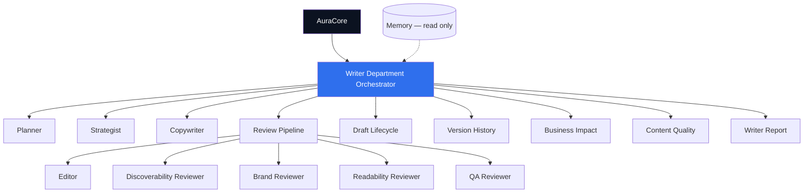

# Writer Department Architecture

## System diagram



## Communication rules

| From | To | Allowed |
| ---- | -- | ------- |
| AuraCore | Orchestrator | ✅ |
| AuraCore | Any module | ❌ |
| Module | Module | ❌ |
| Module | Orchestrator | ✅ (return only) |
| Orchestrator | Module | ✅ |

## Draft lifecycle

```
briefed → planned → strategised → drafted → edited → in_review
                                                      ↓
                                            revision_requested
                                                      ↓
                                                  approved
```

## Review pipeline order

1. Editor — structure and clarity
2. Discoverability Reviewer — customer findability structure
3. Brand Reviewer — voice and values
4. Readability Reviewer — plain English
5. QA Reviewer — final sign-off

## Models

| Model | Purpose |
| ----- | ------- |
| `ContentDraft` | Central content artefact |
| `BusinessImpact` | Estimated visitor/lead impact |
| `ContentQuality` | Aggregated reviewer scores |
| `RevisionRequest` | Change request from a reviewer |
| `WriterReport` | Department activity report |
| `VersionHistory` | Audit trail per draft |

## Future AI integration points

| Module | Integration point |
| ------ | ----------------- |
| Copywriter | `copywriterModule.execute()` — draft body generation |
| Editor | `editorModule.execute()` — intelligent editing |
| Brand Reviewer | Compare against `BrandMemory` from Memory |
| Strategist | Angle generation from Scout opportunities |
| Planner | Outline from AuraCore brief + Scout data |

Do not integrate AI until Phase 3. All points above accept mock data today.
